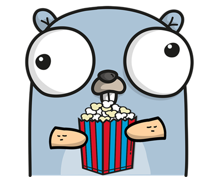

# GoToTheMovies

## About
GoToTheMovies is a small file streaming server I build for personal use.

- GET Request to /films lists all available movie films in a directory
    - TODO: make foldername custom, more filetypes
- GET Request to /films/{name} lists information about the Movie
- GET Request to /films/{name}/watch serves the file with given name

## Setup
Use either:
- Taskfile
  - you will need [go-task](https://taskfile.dev/) for this
  ```shell
  # run task with default build target (no args) to setup, test and build the application
  task
  # you can also run every task independently (test, clean, ...) 
  # - task test
  # - task clean
  # execute file
  ./goto
  ```
- Docker
  ```shell
  # Run Docker client
  # cd into project root
  cd gotothemovies
  # build docker image e.g.
  docker build --tag docker-goto .
  # spin up the container
  docker run -d --publish 8080:8080 -v /your_folder_with_files:/app/films docker-goto
  ```